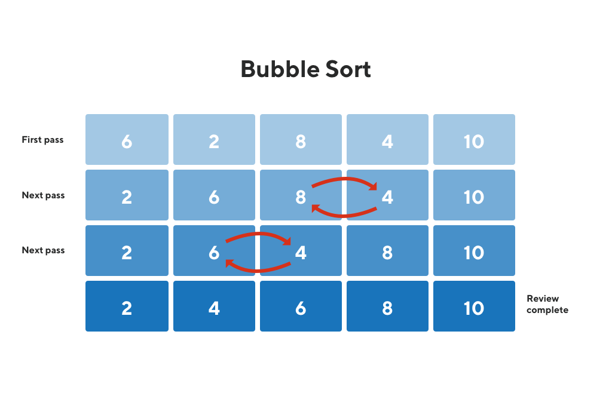

# Sorting algorithms

Here you can found annotations about existing sorting algorithms and links to the implementation.

## Bubble sort

The most simple (I think) following the correct steps make this work fine.

### Use case for this

- A set of data ordered (or near this), it isn't the case performance will be bad (really bad).

### How it works?

Iterate each index of the set of data and verify if the current element is bigger than the next
element, if it is the case, re-order this (place the current element in the index of the next), however
it will init a cycle.

Yes, the above cycle will stop when all data is completely sorted as expected.



### Implementation

Open this [file code](../code/sorting-algorithms/bubble-sort.c).

## Insertion sort

The insertion sort compared with Bubble sort in some situations, like a new insert of data in a set of cards that already is ordered (e. g. like a new card incoming in a ordered deck).

### How it works?

With the second element of the set, iterate all the items verifying if the elements left side elements are bigger than the current value, move that to the right.

### Implementation

Open this [file code](../code/sorting-algorithms/insertion-sort.c).

## Selection sort

Pick the minor value and put on the place of the current initial index, ordering totally.

### How it works?

```
Non ordered: [3,1,6,4]

Step 1:
  - Current index: 0
  - Minor value: 1
  - Set: [1,3,6,4]

Step 2:
  - Current index: 1
  - Minor value: 3
  - Set: [1,3,6,4]

Step 3:
  - Current index: 2
  - Minor value: 4
  - Set: [1,3,4,6]

Step 4:
  - Current index: 3
  - Minor value: 6
  - Set: [1,3,4,6]

Happy =) Ordered successfully
```

### Implementation

A simple implementation in C language, open [here](./code/sorting-algorithms/selection-sort.c)

## Shell sort

The shell is the most performatic sort algorithm of quadratic complexity

### How it works?

Simply, this split the set of data in segments and apply the [insertion sort](#insertion-sort) for each segment.

**Example**:

```
Non ordered: [44 57 11 44 96 21 9 70]

H = 4
H = 13

Step 1:
  - H: 13
  - Set: [44 57 11 44 96 21 9 70]
Step 2:
  - H: 13/3 = 4
  - Set: [44 57 11 44 96 21 9 70]
Step 3:
  - H: 4/3 = 1
  Step 3.1: (init of insertion sort)
    - I: 1
    - Set: [44 57 11 44 96 21 9 70]
  Step 3.2:
    - I: 2
    - Set: [11 44 57 44 96 21 9 70]
  Step 3.3:
    - I: 3
    - Set: [11 44 44 57 96 21 9 70]
  Step 3.4:
    - I: 4
    - Set: [11 44 44 57 96 21 9 70]
  Step 3.5:
    - I: 5
    - Set: [11 21 44 44 57 96 9 70]
  Step 3.6:
    - I: 6
    - Set: [9 11 21 44 44 57 96 70]
  Step 3.7:
    - I: 7
    - Set: [9 11 21 44 44 57 70 96]

```

### Implementation

A simple implementation made in C language, open [here](./code/sorting-algorithms/shell-sort.c)

## Merge Sort

The merge sort is basically about the divide, solve recursively divided parts, and join all that.

### How it works?

Recursively split the dataset into two parts, when all the segments are equally length 2, sort these two elements, finally merge them all.

**As explicit in the example below**:

```
Non ordered: [44 57 11 44 96 21 9 70]

Division steps:

  Step 1:
    - vector: [44 57 11 44 96 21 9 70]
    - Length: 8

  Step 2:
    - vector: [44 57 11 44] [96 21 9 70]
    - Length: 4

  Step 3:
    - vector: [44 57] [11 44] [96 21] [9 70]
    - Length: 2

Sort and merge steps:

  Step 4:
    - vector: [44 57] [11 44] [21 96] [9 70]
    - length: 2

  Step 5:
    - vector: [11 44 44 57] [9 21 70 96]
    - length: 4

  Step 6:
    - vector: [9 11 21 44 44 57 70 96]
    - length: 8

```

### Implementation

An implementation in C lang can be found [here](./code/sorting-algorithms/merge-sort.c).
